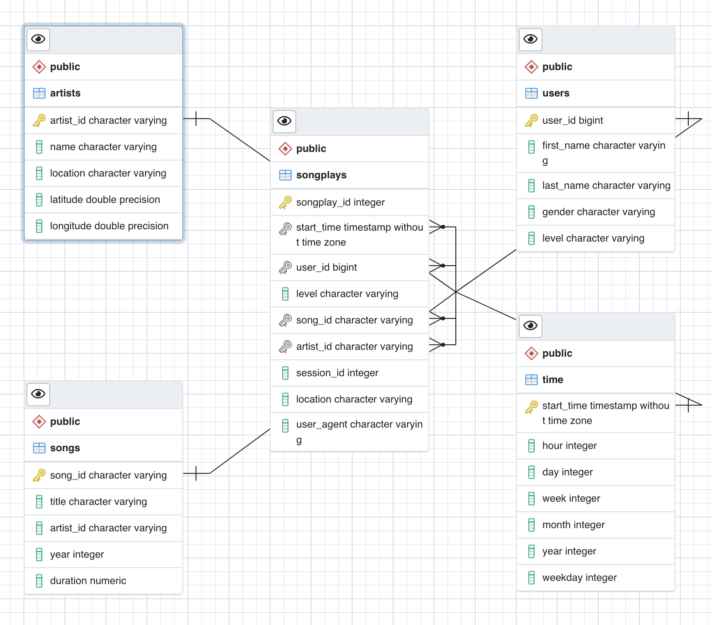

# Sparkify ETL Pipleine

Welcome to our Sparkify ETL pipeline documentation!

## About this project

The purpose of this project is to define and populate an analytics database for Sparkify data analysts to use to perform their song play analysis. The project consists of the the following: - The `sparkifydb` database, a set of tables designed for performing efficient analytic queries. - Extract, Transform, Load (ETL) scripts to pull data from JSON files and load it into the database.

## Getting started with the project

1. Clone or fork the repository.
2. Create and activate a virtual environment in the repository directory. For example:
   ```
    python3 -m venv .venv
    source .venv/bin/activate
   ```
3. Install the Python package requirements:

   ```
    python3 -m pip install -r requirements.txt
   ```

4. Run this first to create your database and tables.

   `python3 sql_queries.py`

   NOTE: You must have access to a local or remote PostgreSQL database server with permissions to create and drop databases.

5. Run the [ETL pipeline files](#etl-pipeline-files):
   - For the jupyter notebook files, enter `jupyter notebook` at your command prompt. Jupyter will open in a new browser window and you can navigate to the notebook files.
   - For the .py files, enter `python3 <filename>.py` at your command prompt.

## Source Data

The source data for this project is two collections of JSON files from the Sparkify music streaming app.

### song_data

A set of directories and JSON files with information about the songs available in the Sparkify app. This dataset is a subset of song data. Each file contains song and artist metadata.

Sample song record:

```
{
  "num_songs": 1,
  "artist_id": "ARULZCI1241B9C8611",
  "artist_latitude": null,
  "artist_longitude": null,
  "artist_location": "",
  "artist_name": "Luna Orbit Project",
  "song_id": "SOSWKAV12AB018FC91",
  "title": "Midnight Star",
  "duration": 335.51628,
  "year": 0
}
```

### log_data

A set of directories and JSON files that contain logs on user activity on the Sparkify app.

Sample log record:

```
{
    "artist":"Deas Vail",
    "auth":"Logged In",
    "firstName":"Elijah",
    "gender":"M",
    "itemInSession":0,
    "lastName":"Davis",
    "length":237.68771,
    "level":"free",
    "location":"Detroit-Warren-Dearborn, MI",
    "method":"PUT",
    "page":"NextSong",
    "registration":1540772343796,
    "sessionId":985,
    "song":"Anything You Say (Unreleased Version)",
    "status":200,
    "ts":1543607664796,
    "userAgent":"\"Mozilla/5.0 (Macintosh; Intel Mac OS X 10_9_4) AppleWebKit/537.77.4 (KHTML, like Gecko) Version/7.0.5 Safari/537.77.4\"",
    "userId":"5"
}
```

## ETL pipline files

The following files implement the extract, transform, load (ETL) pipline for the Sparkify data model:

- `sql_queries.py` - Contains all of the SQL code used in the pipeline including SQL queries to create and drop the data model tables and insert data into the tables.
- `create_tables.py` - Script to automate the process of deleting ETL tables from the previous run and creating the required tables for the Sparkify data model.
- `etl.ipynb` - Runs the ETL process for a single record in each table. Implements functions to extract data from the `log_data` and `song_data` files, transform the data to the required format for the data schema, and insert the data into the appropriate tables in the Sparkify database.
- `etl.py` - Runs the ETL process on all files in the `log_data` and `song_data` subfolders. Implements functions to extract data from the `log_data` and `song_data` files, transform the data to the required format for the data schema, and insert the data into the appropriate tables in the Sparkify database.
- test.ipynb`- Contains tests to ensure that the `INSERT` statments are adding the intended values to tables, and checks for primary keys, column types, and constraints.

## Data Model

Here is the schema of our data model:



### Songplays

Fact table that contains a row for each song played.

| column      | type                     | notes                            |
| ----------- | ------------------------ | -------------------------------- |
| songplay_id | INT                      | Primary key.                     |
| start_time  | TIMESTAMP WITH TIME ZONE | Not null and unique constraints. |
| user_id     | BIGINT                   | Not null constraint.             |
| level       | VARCHAR                  |                                  |
| song_id     | VARCHAR                  |                                  |
| artist_id   | VARCHAR                  |                                  |
| session_id  | INT                      |                                  |
| location    | VARCHAR                  |                                  |
| user_agent  | VARCHAR                  |                                  |

### Users

Dimension table that contains a row for each Sparkify user.

| column     | type    | notes       |
| ---------- | ------- | ----------- |
| user_id    | BIGINT  | Primary key |
| first_name | VARCHAR |             |
| last_name  | VARCHAR |             |
| gender     | VARCHAR |             |
| level      | VARCHAR |             |

### Songs

Dimension table that contains a row for each song in the Sparkify catalog.

| column    | type    | notes                |
| --------- | ------- | -------------------- |
| song_id   | VARCHAR | Primary key.         |
| title     | VARCHAR | Not null constraint. |
| artist_id | VARCHAR |                      |
| year      | INT     |                      |
| duration  | NUMERIC | Not null constraint. |

### Artists

Dimension table that contains a row for each artist in the Sparkify catalog.

| column    | type             | notes                |
| --------- | ---------------- | -------------------- |
| artist_id | VARCHAR          | Primary key.         |
| name      | VARCHAR          | Not null constraint. |
| location  | VARCHAR          |                      |
| latitude  | DOUBLE PRECISION |                      |
| longitude | DOUBLE PRECISION |                      |

### Time

Dimension table that contains a row for each timestamp, with columns with pre-prosessed dimensions including day, month, and year to simplify and optimize date-based analytic queries.

| column     | type                     | notes        |
| ---------- | ------------------------ | ------------ |
| start_time | TIMESTAMP WITH TIME ZONE | Primary key. |
| hour       | INT                      |              |
| day        | INT                      |              |
| week       | INT                      |              |
| month      | INT                      |              |
| year       | INT                      |              |
| weekday    | INT                      |              |
